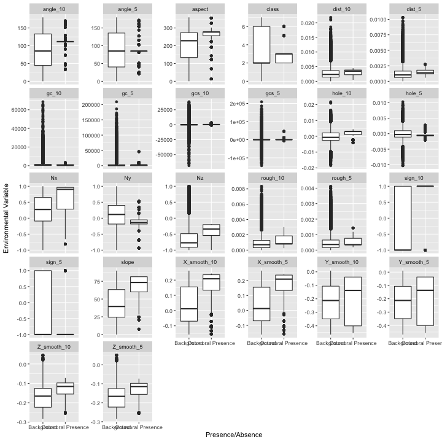
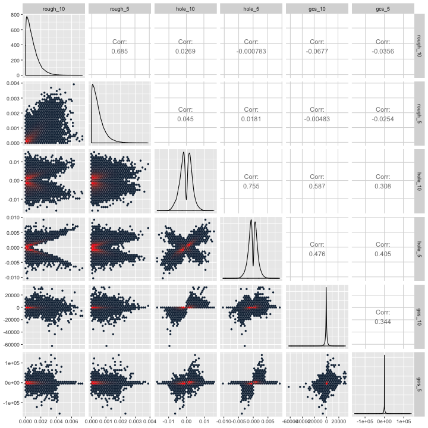
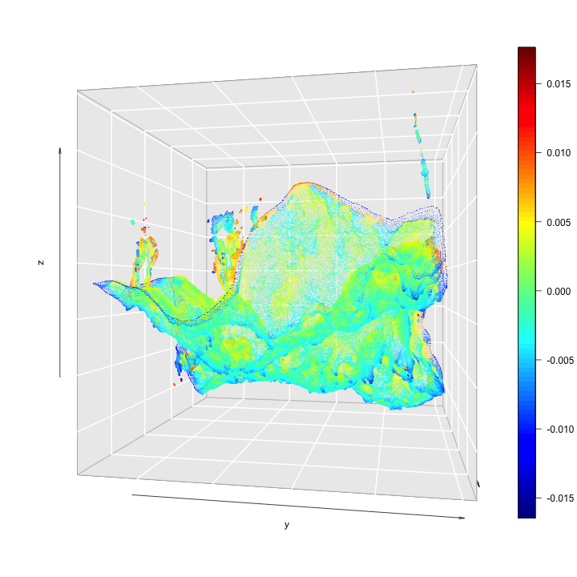
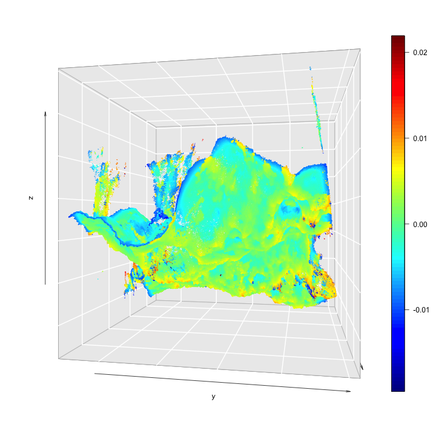
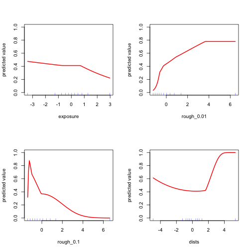
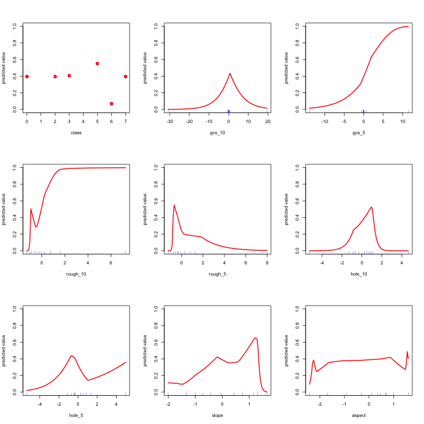
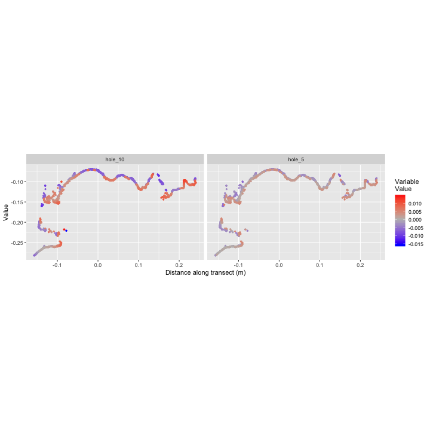
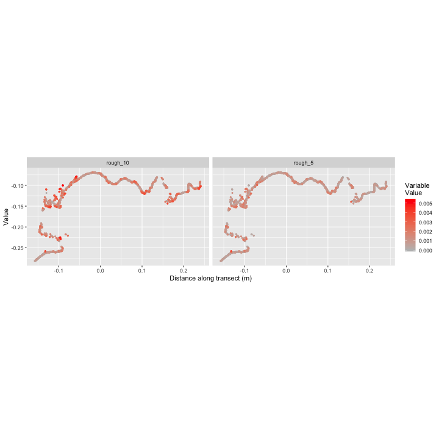
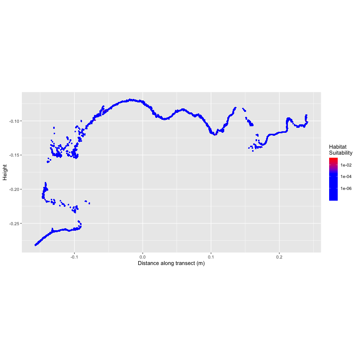

# Setup

Load packages, etc.


```r
options(java.parameters = "-Xmx2048m")
library(rJava)

library(rgdal)
library(sf,quietly = T)
library(sf,quietly = T)
library(dismo)
library(ENMeval)
library(ggplot2)
library(dplyr)
library(tidyr)
library(knitr)
library(scatterplot3d) 
library(threejs)

library(rgl)
library(viridis)
library(GGally)
library(plot3D)

# RGL options
#options(rgl.useNULL = TRUE)
#rgl::setupKnitr()
```

## Data Import

This reads in the data object created with Data_Processing.Rmd.


```r
load("data/model.Rdata")
d$taxa[is.na(d$taxa)]="NULL"
d=na.omit(d)

kable(head(d))
```


|taxa |       Rf|       Gf|       Bf| class|       Nx|        Ny|        Nz| X_smooth_10| Y_smooth_10| Z_smooth_10| X_smooth_5| Y_smooth_5| Z_smooth_5|    gc_10|     gc_5| rough_10|  rough_5|   aspect|    slope|   dist_10|    dist_5| angle_10|  angle_5| sign_10|   hole_10|   gcs_10| sign_5|     hole_5| gcs_5|       X|        Y|        Z| pres| id|
|:----|--------:|--------:|--------:|-----:|--------:|---------:|---------:|-----------:|-----------:|-----------:|----------:|----------:|----------:|--------:|--------:|--------:|--------:|--------:|--------:|---------:|---------:|--------:|--------:|-------:|---------:|--------:|------:|----------:|-----:|-------:|--------:|--------:|----:|--:|
|Esp  | 0.231373| 0.258824| 0.129412|     3| 0.963878| -0.133805| -0.202748|    0.234749|   -0.038594|    -0.09787|   0.236314|  -0.036712|  -0.097472| 350.6579| 2372.272| 0.000811| 0.000348| 277.3898| 81.39322| 0.0038411| 0.0013574|   111.44| 84.94856|       1| 0.0030888| 199.5404|     -1| -0.0006447|     0| 0.23642| -0.03628| -0.09823|    1|  1|
|Esp  | 0.231373| 0.258824| 0.129412|     3| 0.963878| -0.133805| -0.202748|    0.234749|   -0.038594|    -0.09787|   0.236314|  -0.036712|  -0.097472| 350.6579| 2372.272| 0.000811| 0.000348| 277.3898| 81.39322| 0.0038411| 0.0013574|   111.44| 84.94856|       1| 0.0030888| 199.5404|     -1| -0.0006447|     0| 0.23642| -0.03628| -0.09823|    1|  2|
|Esp  | 0.231373| 0.258824| 0.129412|     3| 0.963878| -0.133805| -0.202748|    0.234749|   -0.038594|    -0.09787|   0.236314|  -0.036712|  -0.097472| 350.6579| 2372.272| 0.000811| 0.000348| 277.3898| 81.39322| 0.0038411| 0.0013574|   111.44| 84.94856|       1| 0.0030888| 199.5404|     -1| -0.0006447|     0| 0.23642| -0.03628| -0.09823|    1|  3|
|Esp  | 0.231373| 0.258824| 0.129412|     3| 0.963878| -0.133805| -0.202748|    0.234749|   -0.038594|    -0.09787|   0.236314|  -0.036712|  -0.097472| 350.6579| 2372.272| 0.000811| 0.000348| 277.3898| 81.39322| 0.0038411| 0.0013574|   111.44| 84.94856|       1| 0.0030888| 199.5404|     -1| -0.0006447|     0| 0.23642| -0.03628| -0.09823|    1|  4|
|Esp  | 0.231373| 0.258824| 0.129412|     3| 0.963878| -0.133805| -0.202748|    0.234749|   -0.038594|    -0.09787|   0.236314|  -0.036712|  -0.097472| 350.6579| 2372.272| 0.000811| 0.000348| 277.3898| 81.39322| 0.0038411| 0.0013574|   111.44| 84.94856|       1| 0.0030888| 199.5404|     -1| -0.0006447|     0| 0.23642| -0.03628| -0.09823|    1|  5|
|Esp  | 0.231373| 0.258824| 0.129412|     3| 0.963878| -0.133805| -0.202748|    0.234749|   -0.038594|    -0.09787|   0.236314|  -0.036712|  -0.097472| 350.6579| 2372.272| 0.000811| 0.000348| 277.3898| 81.39322| 0.0038411| 0.0013574|   111.44| 84.94856|       1| 0.0030888| 199.5404|     -1| -0.0006447|     0| 0.23642| -0.03628| -0.09823|    1|  6|

Gather data to 'long' (e.g. tidy) form for easier plotting with ggplot.

```r
dl=d%>%sample_frac(.25)%>%
  select(-Bf,-Gf,-Rf)%>% # remove a few variables we won't need in this dataset
  gather(key=var,value = val,-X,-Y,-Z,-id, -taxa,-pres)%>%
  mutate(presence=factor(pres,labels=c("Background","Octocoral Presence")))
```

# Exploratory Data Analysis

Plot the distribution of environmental variables.

## Density plot


```r
dl%>%
  ggplot(aes(val,col=presence))+
  geom_density(aes(y=..scaled..))+
  facet_wrap(~var, scales="free")+
  scale_color_manual(values = c("black","red"),name="")+
  ylab("Scaled Density")+
  xlab("Environmental Variable")
```

```
## Error in eval(lhs, parent, parent): object 'dl' not found
```

## Boxplot comparing background with presences


```r
dl%>%
  ggplot(aes(x=presence,y=val))+
  geom_boxplot()+
  facet_wrap(~var, scales="free_y")+
  xlab("Presence/Absence")+
  ylab("Environmental Variable")
```


## Correlation matrix

Correlation between the variables. Surprisingly even the two "rough" variables are very different.  

```r
my_bin <- function(data, mapping, ..., low = "#132B43", high = "red") {
  ggplot(data = data, mapping = mapping) +
    geom_hex(...) +
    scale_fill_gradient(low = low, high = high)
}

d%>%
  sample_n(100000)%>%
  select(contains("rough"),contains("hole"),contains("gcs"))%>%
  ggpairs(lower = list(continuous = my_bin))
```




## Substrate Type


```r
d%>%
  ggplot(aes(x=as.factor(class),group=as.factor(pres),fill=as.factor(pres)))+
  stat_count(aes(y=..prop..), position='dodge')+
  scale_fill_manual(values=c("black","red"),name="Presence\nAbsence")+
  xlab("Point Classification")+
  ylab("Proportion of Presence/Absences")
```




## 3D Plot

Plot of the new 'hole' metric. 


```r
scatter3D(d$X, d$Y, d$Z,colvar = d$hole_10,bty = "g", cex=.01,theta = 100, phi = 0)
```



```r
# Or make an interactive plot:
#nColors <- 64
#cols <- as.character(cut(fulld$dists,breaks=nColors,labels= inferno(nColors)))
#scatterplot3js(fulld$x,fulld$y,fulld$z, color=cols,size = 0.05,stroke = NULL,pch=".")
```

# Distribution Model

## Prepare data

Create a subsetted, non-spatial table to use for model fitting and scale the variables.


```r
nbg=10000  # number of background points to select

subset_id=c(d$id[d$pres==1], # keep all presences
            d$id[sample(which(d$pres==0),nbg,replace = F)])  # sample only nbg background points

fitdata=d%>%
  mutate(pres=as.logical(pres),
         class=as.factor(class))%>%
  filter(id%in%subset_id)%>%
  select(pres,X,Y,Z,class,gcs_10,gcs_5,rough_10,rough_5,hole_10,hole_5,slope,aspect)%>% #select which variables to include
  mutate_if(is.numeric, function(x) as.vector(scale(x)))%>%  #scale all numeric variables so they have a mean of 0 and slope of 1
  na.omit()#%>% # drop rows with missing variables
```

## Fit Maxent Distribution Model

There are lots of options that will need to be considered.  This is one basic way:


```r
m1 <- maxent(x=select(fitdata,-X,-Y,-Z,-pres),
             p=as.numeric(fitdata$pres),
    args=c(
		'randomtestpoints=30',
		'betamultiplier=1',
		'linear=true',
		'quadratic=true',
		'product=false',
		'threshold=false',
		'hinge=true',
		'threads=4',
		'responsecurves=true',
		'jackknife=true',
		'askoverwrite=false'),
		path="output")
```

## Validation

Need to add model comparison, validation, etc.

## Results

### Variable importance


```r
plot(m1)
```




### Response Curves

Relationship between each predictor (x-axis) and 'habitat suitability.'  These are estimates of the 'realized recuitment niche' based on the environmental data.  Don't put too much confidence in these results - we need to add more data and do much better model validation, etc.


```r
response(m1,expand=0)
```



### Predictions

Predict suitability across the full landscape (for each point).

```r
# make random groups to reduce memory during predictions
d$group=rep(1:100,len=nrow(d))

# calculate the predictions for each point
p1=d%>%
  group_by(group)%>% #this breaks the full dataset down by group to make the predict() go faster
  do(pred=predict(m1, x=.))%>%  # predict habitat suitability for each point
  unnest()
```

## Predicted habitat suitability

3D plot of relative habitat suitability.  Areas in red are more suitable.


```r
nColors <- 64
cols <- as.character(cut(p1,breaks=nColors,labels= rainbow(nColors)))
```

```
## Error in cut.default(p1, breaks = nColors, labels = rainbow(nColors)): 'x' must be numeric
```

```r
scatter3D(fitdata$X, fitdata$Y, fitdata$Z,colvar = p1,bty = "g", cex=.01,theta = 100, phi = 0)
```

```
## Error in scatter3D(fitdata$X, fitdata$Y, fitdata$Z, colvar = p1, bty = "g", : 'colvar' should have same length as 'x', 'y' and 'z'
```


Interactive 3D Figure of Habitat Suitability (same as above using different plotting function).


```r
scatterplot3js(fitdata$x,fitdata$y,fitdata$z, color=cols,size = 0.05,stroke = NULL,pch=".")
```

## Transect

Show values along a transect.  

Extract a transect (I selected the y values using cloud compare).  This really shows the value of doing this in 3D - it can easily capture really complex terrain including caves, etc.


```r
transect=
  cbind.data.frame(d,pred=p1$pred)%>%
#  filter(between(y,-0.122,-0.121))%>%
  filter(between(Y,-0.027,-0.0265))%>%
  mutate(gcs_5=sign(gcs_5)*log(abs(gcs_5)),gcs_10=sign(gcs_10)*log(abs(gcs_10)))%>%
  gather("var","value",-X,-Y,-Z,-pres,-class,-pred,-taxa,-id)%>%
  arrange(value,X,Z)
```

Environmental values:

```r
transect%>%
  filter(var%in%c("gcs_10","gcs_5"))%>%
  ggplot(aes(x=X,y=Z,col=value))+
  geom_point(size=.7)+
  scale_color_gradient2(low="blue",mid="grey",high="red",name="Variable\nValue")+
  facet_wrap(~var)+
  xlab("Distance along transect (m)")+
  ylab("Value")+
  coord_equal()
```


```r
transect%>%
  filter(var%in%c("hole_10","hole_5"))%>%
  ggplot(aes(x=X,y=Z,col=value))+
  geom_point(size=.7)+
  scale_color_gradient2(low="blue",mid="grey",high="red",name="Variable\nValue")+
  facet_wrap(~var)+
  xlab("Distance along transect (m)")+
  ylab("Value")+
  coord_equal()
```



```r
transect%>%
  filter(var%in%c("rough_10","rough_5"))%>%
  ggplot(aes(x=X,y=Z,col=value))+
  geom_point(size=.7)+
  scale_color_gradient2(low="blue",mid="grey",high="red",name="Variable\nValue")+
  facet_wrap(~var)+
  xlab("Distance along transect (m)")+
  ylab("Value")+
  coord_equal()
```



Predicted habitat suitability.  Note some (but not all) little holes full of red.

```r
ggplot(transect,aes(x=X,y=Z,col=pred))+
  geom_point(size=.3)+
  scale_color_gradientn(colors=c("blue","blue","blue","red"),name="Habitat\nSuitability",trans="log10")+
  xlab("Distance along transect (m)")+
  ylab("Height")+
  coord_equal()
```



An added bonus is that this transect kind of looks like a buffalo (head with horns on the left side).  It looks a little messy there because the transect is actually a little ribbon (not just a one-dimensional line) and so includes several values at each y position.  We can think of better ways to show that.

## Export data

Export the data (with predictions) in a format that can be opened by cloud compare.


```r
write.csv(cbind.data.frame(d,pred=p1$pred),"data/modeloutput.txt")
```

## Render this document to markdown

```r
library(ezknitr)
ezknit(file = "vignettes/SDM_3D.Rmd", out_dir = "vignettes")
```
