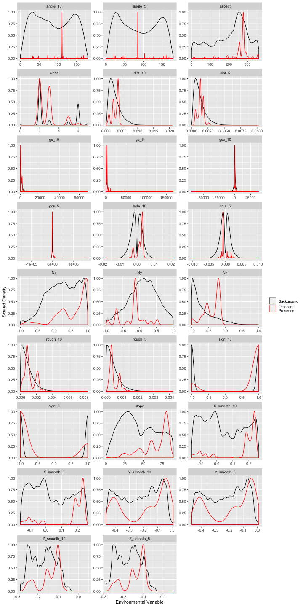
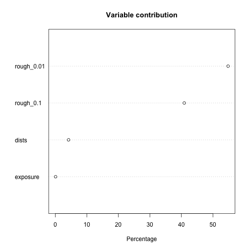
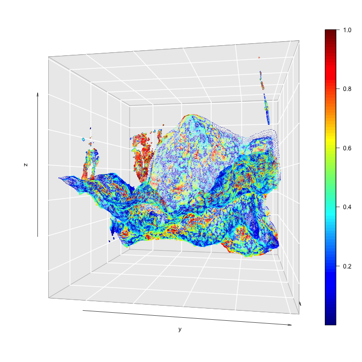

# Setup

Load packages, etc.


```r
library(rgdal)
library(sf,quietly = T)
library(sf,quietly = T)
library(dismo)
library(ENMeval)
library(ggplot2)
library(dplyr)
library(tidyr)
library(knitr)
library(scatterplot3d) 
library(threejs)

library(rgl)
library(viridis)
library(GGally)
library(plot3D)

# RGL options
#options(rgl.useNULL = TRUE)
#rgl::setupKnitr()
```

## Data Import

This reads in the data object created with Data_Processing.Rmd.


```r
getwd()
```

```
## [1] "/Users/adamw/Documents/repos/CoralSDM"
```

```r
load("data/model.Rdata")

kable(head(fulld))
```


|         x|         y|         z| exposure| rough_0.01| rough_0.1|      dists| pres|taxa | id|geometry                                 |
|---------:|---------:|---------:|--------:|----------:|---------:|----------:|----:|:----|--:|:----------------------------------------|
| -0.120020| -0.481466| -0.270159| 0.678460|   0.000769|  0.003606| -0.0092520|    0|NA   |  1|c(-0.12002027, -0.48146573, -0.27015883) |
| -0.128400| -0.481104| -0.270568| 0.682622|   0.000492|  0.000607| -0.0090471|    0|NA   |  2|c(-0.12839967, -0.4811044, -0.27056769)  |
| -0.125073| -0.481106| -0.270931| 0.685744|   0.000862|  0.002328| -0.0090123|    0|NA   |  3|c(-0.12507321, -0.48110572, -0.27093115) |
| -0.112946| -0.482550| -0.266880| 0.672216|   0.000235|  0.003036| -0.0098129|    0|NA   |  4|c(-0.11294573, -0.48254982, -0.26687956) |
| -0.133142| -0.481178| -0.269646| 0.693028|   0.000411|  0.002267| -0.0092736|    0|NA   |  5|c(-0.13314202, -0.48117775, -0.26964629) |
| -0.117696| -0.481763| -0.269313| 0.675338|   0.000506|  0.003650| -0.0094357|    0|NA   |  6|c(-0.1176962, -0.48176348, -0.26931307)  |

Gather data to 'long' (e.g. tidy) form for easier plotting with ggplot.

```r
fulldl=gather(fulld,key=var,value = val,-x,-y,-z,-id, -taxa,-pres,-geometry)%>%
  mutate(presence=factor(pres,labels=c("Background","Octocoral Presence")))
```

# Exploratory Data Analysis

Plot the distribution of environmental variables.

## Density plot


```r
fulldl%>%
  ggplot(aes(val,col=presence))+
  geom_density(aes(y=..scaled..))+
  facet_wrap(~var, scales="free")+
  scale_color_manual(values = c("black","red"),name="")+
  ylab("Scaled Density")+
  xlab("Environmental Variable")
```

```
## Warning: Removed 4 rows containing non-finite values (stat_density).
```



## Boxplot comparing background with presences


```r
fulldl%>%
  ggplot(aes(x=presence,y=val))+
  geom_boxplot()+
  facet_wrap(~var, scales="free_y")+
  xlab("Presence/Absence")+
  ylab("Environmental Variable")
```


## Correlation matrix

Correlation between the variables. Surprisingly even the two "rough" variables are very different.  

```r
my_bin <- function(data, mapping, ..., low = "#132B43", high = "red") {
  ggplot(data = data, mapping = mapping) +
    geom_hex(...) +
    scale_fill_gradient(low = low, high = high)
}

ggpairs(fulld,columns=4:7,  lower = list(continuous = my_bin))
```


## 3D Plot

Plot of the new 'dists' metric. We really need a better name.


```r
scatter3D(fulld$x, fulld$y, fulld$z,colvar = fulld$dists,bty = "g", cex=.01,theta = 100, phi = 0)
```


```r
# Or make an interactive plot:
#nColors <- 64
#cols <- as.character(cut(fulld$dists,breaks=nColors,labels= inferno(nColors)))
#scatterplot3js(fulld$x,fulld$y,fulld$z, color=cols,size = 0.05,stroke = NULL,pch=".")
```

# Distribution Model

## Prepare data

Create a subsetted, non-spatial table to use for model fitting and scale the variables.


```r
fitdata=fulld%>%
  select(pres,x,y,z,exposure,rough_0.01,rough_0.1,dists)%>% #select which variables to include
  mutate(exposure=as.numeric(scale(exposure)),
         rough_0.01=as.numeric(scale(rough_0.01)),
         rough_0.1=as.numeric(scale(rough_0.1)),
         dists=as.numeric(scale(dists)))%>%
    st_set_geometry(NULL)%>%  # drop the geometry column
  na.omit() # drop rows with missing variables
```

## Fit Maxent Distribution Model

There are lots of options that will need to be considered.  This is one basic way:


```r
m1 <- maxent(x=fitdata[,-c(1:4)],p=fitdata[,1],
    args=c(
		'randomtestpoints=30',
		'betamultiplier=1',
		'linear=true',
		'quadratic=true',
		'product=false',
		'threshold=false',
		'hinge=true',
		'threads=2',
		'responsecurves=true',
		'jackknife=false',
		'askoverwrite=false'))
```

## Validation

Need to add model comparison, validation, etc.

## Results

### Variable importance


```r
plot(m1)
```




### Response Curves

Relationship between each predictor (x-axis) and 'habitat suitability.'  These are estimates of the 'realized recuitment niche' based on the environmental data.  Don't put too much confidence in these results - we need to add more data and do much better model validation, etc.


```r
response(m1,expand=0)
```


### Predictions

Predict suitability across the full landscape.

```r
p1 <- predict(m1, fitdata[,-1])
```

## Predicted habitat suitability

3D plot of relative habitat suitability.  Areas in red are more suitable.


```r
nColors <- 64
cols <- as.character(cut(p1,breaks=nColors,labels= rainbow(nColors)))

scatter3D(fitdata$x, fitdata$y, fitdata$z,colvar = p1,bty = "g", cex=.01,theta = 100, phi = 0)
```



Interactive 3D Figure of Habitat Suitability (same as above using different plotting function).


```r
scatterplot3js(fitdata$x,fitdata$y,fitdata$z, color=cols,size = 0.05,stroke = NULL,pch=".")
```

## Transect

Show values along a transect.  

Extract a transect (I selected the y values using cloud compare)


```r
transect=
  cbind(fitdata,p1)%>%
  filter(between(y,-0.122,-0.121))%>%
  gather("var","value",-x,-y,-z,-pres,-p1)%>%
  arrange(value,x,z)
```

Environmental values:

```r
ggplot(transect,aes(x=x,y=z,col=value))+
  geom_point(size=.7)+
  scale_color_gradient2(low="blue",mid="grey",high="red",name="Variable\nValue")+
  facet_grid(var~.)+
  xlab("Distance along transect (m)")+
  ylab("Height")
```


Predicted habitat suitability.  Note some (but not all) little holes full of red.

```r
ggplot(transect,aes(x=x,y=z,col=p1))+
  geom_point(size=.7)+
  scale_color_gradientn(colors=c("blue","grey","red"),name="Habitat\nSuitability")+
  xlab("Distance along transect (m)")+
  ylab("Height")
```


## Export data

Export the data (with predictions) in a format that can be opened by cloud compare.


```r
write.csv(cbind.data.frame(fitdata,p1),"data/modeloutput.txt")
```

## Render this document to markdown

```r
library(ezknitr)
ezknit(file = "vignettes/SDM_3D.Rmd", out_dir = "vignettes")
```
